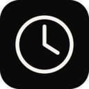
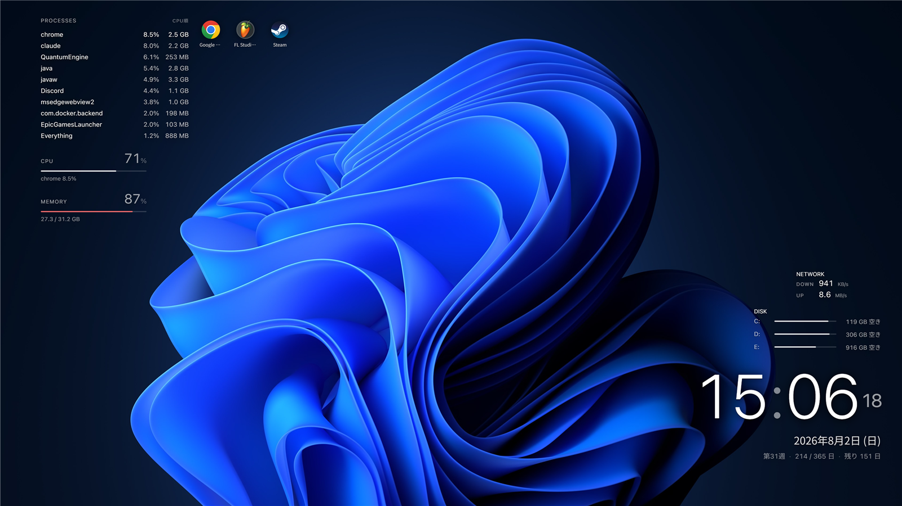
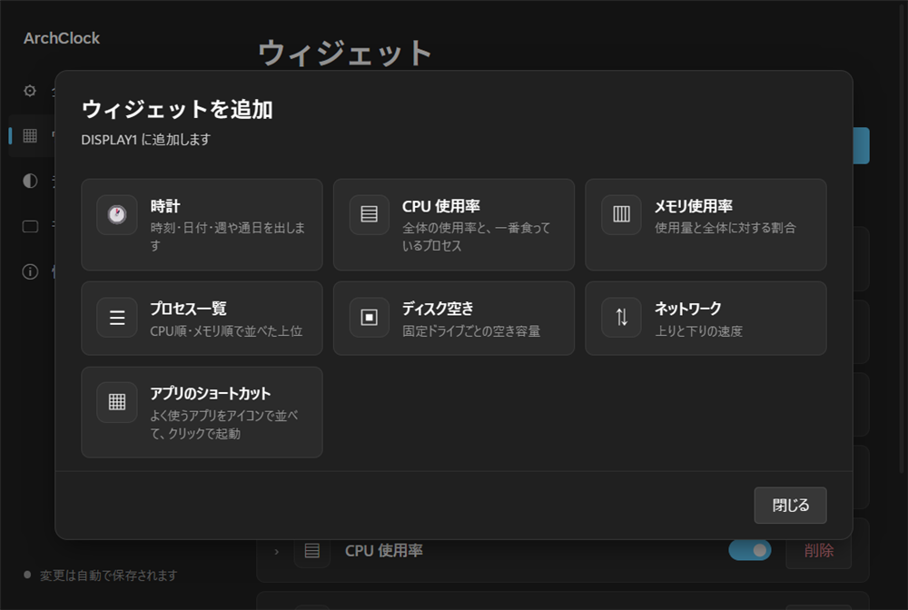
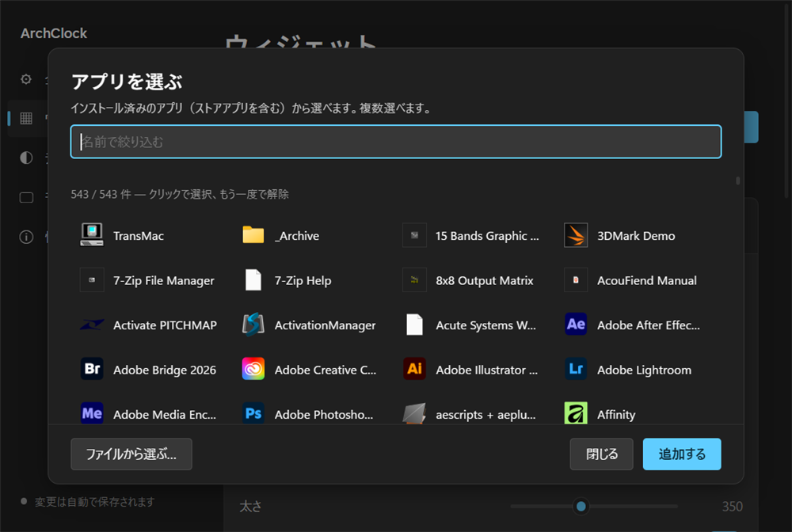
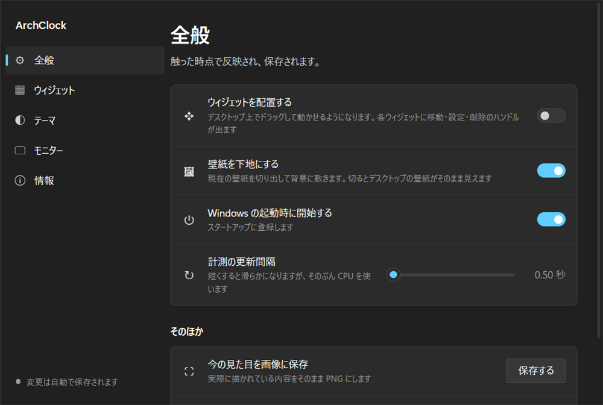

<div align="center">



# ArchClock

**デスクトップの壁紙レイヤーで動くウィジェット。**
アイコンの後ろ、すべてのウィンドウの後ろ。邪魔をしないところに置く。

Windows 10 / 11 · MIT License



</div>

---

## これは何

壁紙の上に時計や使用率を出すツールです。ウィジェットは**普通のウィンドウではなく壁紙のレイヤー**に貼り付くので、Alt+Tab にも出ず、他のウィンドウを操作している間もずっと後ろにいます。

見た目は引き算で作ってあります。既定では板も枠もグラデーションも置かず、壁紙の上に文字だけが乗ります。地が必要なら、すりガラスか半透明の黒を選べます。

## できること

- **7種のウィジェット** — 時計 / CPU / メモリ / プロセス一覧 / ディスク / ネットワーク / アプリのショートカット
- **モニターごとに別の配置** — 解像度も拡大率もバラバラでよい。位置は比率で持つので構成が変わっても崩れない
- **壁紙をそのまま下地に** — Fill / Fit / 拡大 / 中央 / タイル / スパン / 単色、モニター別の壁紙、スライドショーに追従
- **ドラッグで配置** — 画面の端・中央・他のウィジェットの辺に吸い付く。ガイド線が出る
- **ショートカットから起動** — ストアアプリも含めて 500 件超から検索して選べる
- **設定はすべて即反映・自動保存**

## 動かすもの

| | |
|---|---|
| OS | Windows 10 1809 以降 / Windows 11 |
| 必要なもの | [WebView2 ランタイム](https://developer.microsoft.com/microsoft-edge/webview2/)（Windows 11 には標準で入っています） |
| ビルドする場合 | .NET 10 SDK |

## 入れる

[Releases](../../releases) から `ArchClock.zip` を落として、好きな場所に展開して `ArchClock.exe` を実行するだけです。インストーラーはありません。

設定は `%LOCALAPPDATA%\ArchClock\` に作られます。消せば初期状態に戻ります。

### ソースからビルド

```powershell
git clone https://github.com/nisesimadao/ArchClock.git
cd ArchClock
dotnet publish -c Release -o app
.\app\ArchClock.exe
```

## 使う

起動するとタスクトレイに時計のアイコンが出ます。**ダブルクリックで設定**、右クリックでメニューです。

### ウィジェットを置く

設定 → **ウィジェット** → 「＋ ウィジェットを追加」から選びます。



### 位置を決める

トレイの「ウィジェットを配置」か、設定の「デスクトップで配置」で配置モードに入ります。

デスクトップ上でウィジェットにカーソルを乗せると、**移動 ✥ / 設定 ⚙ / 削除 ✕** のハンドルが出ます。そのままドラッグして動かせます。画面の端・中央・他のウィジェットの辺に吸い付き、青いガイド線が出ます。

### アプリのショートカット



スタートの「すべてのアプリ」と同じ一覧から選べます。ストアアプリも含まれます。検索で絞り込んで複数まとめて追加できます。

デスクトップ上でアイコンをクリックすると起動します（配置モード中を除く）。

### 設定



保存ボタンはありません。触った時点で反映され、保存されます。OS の明暗テーマに追従します。

## ウィジェットと設定できること

| ウィジェット | 主な設定 |
|---|---|
| **時計** | 大きさ・太さ / 24時間表示 / 秒 / 日付の書き方3種 / 補助行（週番号・通日・残り日数）を個別に |
| **CPU** | 数値の大きさ・小数点 / バー / **しきい値を超えたら色を変える** / よく食っているプロセスを何件出すか |
| **メモリ** | 使用率・使用量・空きの切替 / バー / しきい値の色 / 内訳の表示 |
| **プロセス一覧** | CPU順・メモリ順 / 表示数 / 列（CPU・メモリ・PID）を個別に / 行の大きさと間隔 |
| **ディスク** | 空き・使用量・使用率・「空き/全体」 / バー / **対象ドライブの絞り込み** |
| **ネットワーク** | 上り下りを個別に / 単位を自動・KB/s・MB/s / 見出しの文字を差し替え |
| **ショートカット** | 縦横の並び / アイコンの大きさ・間隔・角の丸み / 名前の表示 |

共通で **揃え・幅・不透明度・見出しの表示と文字**を変えられます。テーマではフォント（欧文/和文別）、文字色、アクセント色、影の強さ、ウィジェットの地を選べます。

## 仕組み

作るうえで引っかかったところを残しておきます。同じことをする人の役に立つかもしれません。

**壁紙レイヤーへの貼り付け**
`Progman` に `0x052C` を送ると壁紙用の `WorkerW` が生えます。ただし生え方が2通りあり、従来は `SHELLDLL_DefView` を持つウィンドウの**次の兄弟**でしたが、最近の Windows 11 では `Progman` の**子**として生えます。両方を見る必要があります。

**SetParent は一度だけ**
WinForms のフォームに後から `SetParent` するとハンドルが作り直され、中の WebView2 が破棄済みになって落ちます。`explorer.exe` が再起動して親を失った場合は、貼り直すのではなく**プロセスごと入れ替え**ます。

**混在DPI**
壁紙レイヤーの子になった窓は、親（主モニター）の DPI コンテキストで描かれることがあります。`Control.DeviceDpi` は当てにならないので、ページに実際の CSS ピクセル数を報告させて実測し、そのモニター本来の拡大率との比を打ち消しています。

**クリックの受け取り**
壁紙レイヤーはデスクトップアイコンの下なので、クリックが届きません。低レベルマウスフックで拾って転送しています。判定は「前面のウィンドウがデスクトップか」ではなく「**カーソルの真下にデスクトップが見えているか**」で行います。前者だと他のアプリにフォーカスがある間ずっと反応しなくなります。

また、押下をフックでブロックしている以上システムは押下を知らないため、ドラッグ中に `GetAsyncKeyState` を当てにしてはいけません。

## うまく動かないとき

`%LOCALAPPDATA%\ArchClock\archclock.log` に例外が残ります。

クリックが効かない場合は、同じフォルダに空ファイル `diagnose.on` を置いて再起動すると、押下のたびに「カーソルの真下が何のウィンドウか」「当たり判定に入ったか」が1行ずつ記録されます。

ウィジェットが消えた場合は `explorer.exe` の再起動が原因のことが多く、通常は5秒以内に自動で復帰します。

## ライセンス

[MIT](LICENSE)
